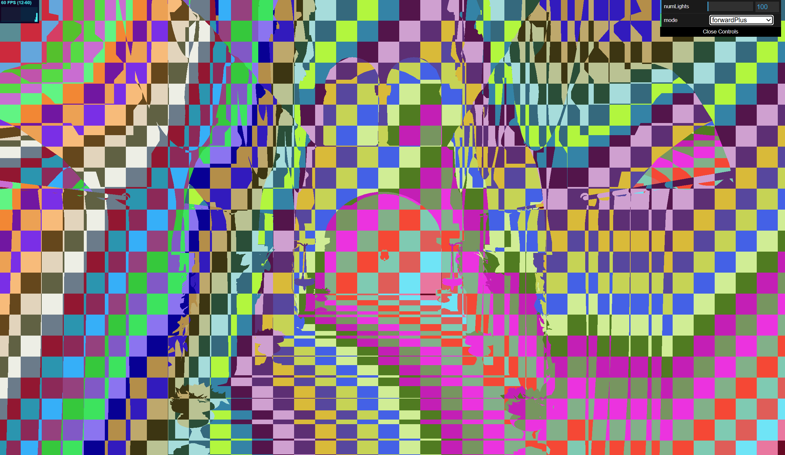

WebGL Forward+ and Clustered Deferred Shading
======================

**University of Pennsylvania, CIS 565: GPU Programming and Architecture, Project 4**

* Lewis Ghrist
* Tested on: **Google Chrome 141.0.7390.108** on
  Windows 11, Intel Core i7-13700H, 32.0 GB RAM

### Live Demo

[LIVE DEMO:](https://siwel-cg.github.io/Project4-WebGPU-Forward-Plus-and-Clustered-Deferred/)

## A Quick Note
If you take a look at the live demo, you will notice there are some things missing. I wasn't able to implement all the features, and some of the ones I was able to implement leave lots of room for improvement. I am going to keep working on this and have a full analysis once everything has been implemented, but for now, you are stuck with jank. However, let just look at some of the things I did do (as of 10/18/25), since in my implementation, they are more visually interesting than a plane black screen.

# Overview
First off, what was I trying to do. As scenes become more and more complex, we need to develop new methods for handaling the increased amounts of calculations needed to actually render these complex scene. One such complexity is the number of lights in a scene. When rasterizing, for some fragment and the object it hits, we need to calculate what that pixel is going to look like, which usually involves some sort of lighting calculation. Simply, test each light for it's contribution to the lighting of that fragment and we get a nice result. The only problem is, as the number of lights increases, this naive test becomes much too slow. The solution, pre-process lights into clusters so that we only need to check the lights within a given fragment's cluster. This is the core idea behind the Forward+ approach. 

# Forward+
So, what do I mean by clusters. First, consider a small patch of pixels. Just isolating those pixels and the part of the frustrum they span, we get a "mini-frustrum" which see part of our scene. The volume of that mini-frustrum is where we want to check for lights. If a light has a significant effect within that volume, we want to check it with each fragment in that patch. Now, obviously if we were doing a path tracer, then technically all the lights could potentially have an effect since light bounces around all over the scene. But we aren't, so some shortcuts need to be taken since we are prioritizing speed over realism. In this project, our lights were simply point lights. As such, we define a simple radius for each light and that is what determines if a light effects our mini-frustrum. Not we can take this one step furthur. Within this mini-frustrum, there could be a lot of just empty space. This means a basic bounds test would still include a light even though there is no geometry near it to actually do anything. So, we slice that mini-frustrum along the camera Z axis aswell. This gives us small, but precise 3D clusters. If a cluster has geometry in it and a light effects it, then we add that light to that cluster's light list so that our fragments checks it. This takes the number of light check per fragment down significantly and, if implemented correctly, can allow for thousands of lights to be rendered while still keeping good performance. 

Here are some images of what this clustering looks like from the camera:

## So what went wrong
If you play around with the live demo, you might notice that Forward+ doesn't really do anything significant. Maybe for a larger number of lights it has slight improvements over naive, but for the most part they are both about the same and both pretty slow. I have an idea as to why, but haven't been able to get the fix working. In my cluster compute shader, I set the light radius that I use in my bounding intersection test to 20 instead of 2. This is intential, because without that, you can't really see anything. However, by setting the radius to be that large, the clusters don't really do anything different from naive because most light intersection most clusters. 

The reason I need to set the radius to 20 has to do with the depth some how. I tried all sorts of ways to linearize the fragment depth to get a nice 0 to 1 depth map, but nothing was working. The best I could do was a hack where you linearize based on a hard coded scene max depth. My compute shader still uses the old depth, which has values only within a small radius around the camera, and thus only light within that region get detected I think. Still not 100% sure, but that is my current guess. 

# Run Time
My Forward+ although it's getting there, is no where near what it needs to be. As such, I don't really have anything to test. The only way for you to be able to see anything is if you turn up the light radius a bunch, but then, as mentioned, this is basically just naive. I could do different cluster sized and configurations, but the results weren't that significant. I couldn't really see any performance differences. Part of this could be my laptop not being that strong of a machine, but overall, knowing the performance results of a buggy implementation I am going to fix didn't seem relevent.

### Credits

- [Vite](https://vitejs.dev/)
- [loaders.gl](https://loaders.gl/)
- [dat.GUI](https://github.com/dataarts/dat.gui)
- [stats.js](https://github.com/mrdoob/stats.js)
- [wgpu-matrix](https://github.com/greggman/wgpu-matrix)
- [Coordinate-Systems](https://learnopengl.com/Getting-started/Coordinate-Systems)
- [depth](https://matthewmacfarquhar.medium.com/webgpu-rendering-part-3-depth-testing-39d4c9ae5bbd)
- CIS 5600 SLIDES 
